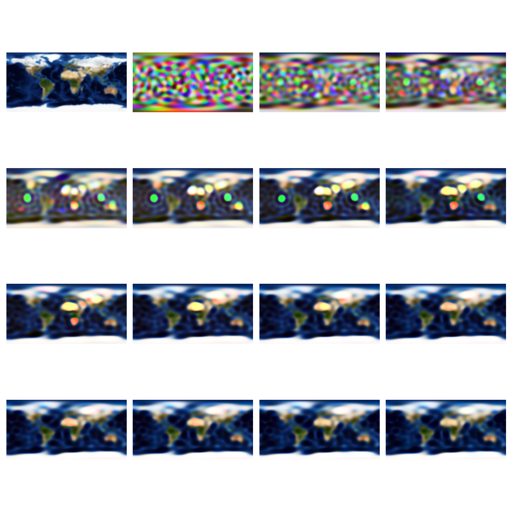
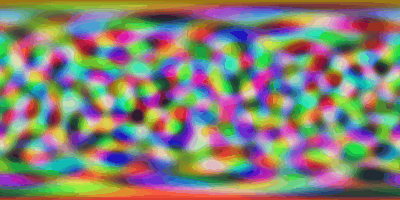

# spherical-harmonics-example
An Example of Spherical Harmonics in JAX

```
uv init
uv add "jax[cuda12]" numpy pillow optax matplotlib
uv run main.py
```

## Original image


## Training progress



## Annimation

